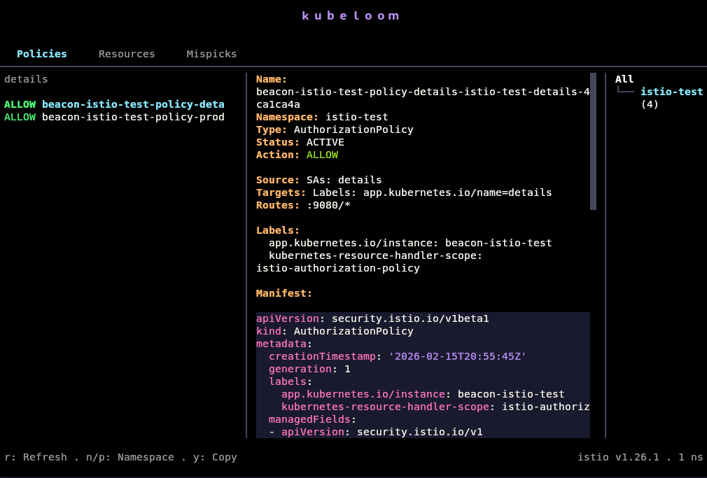
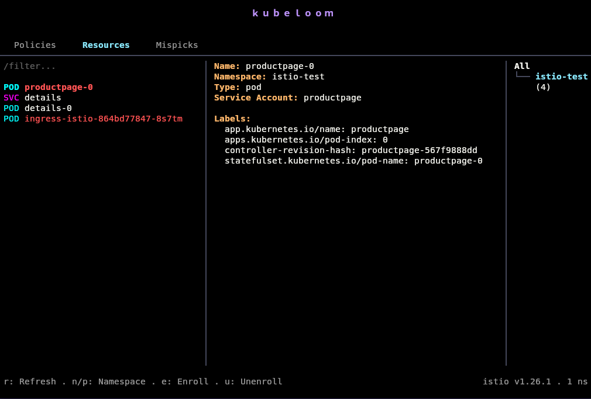
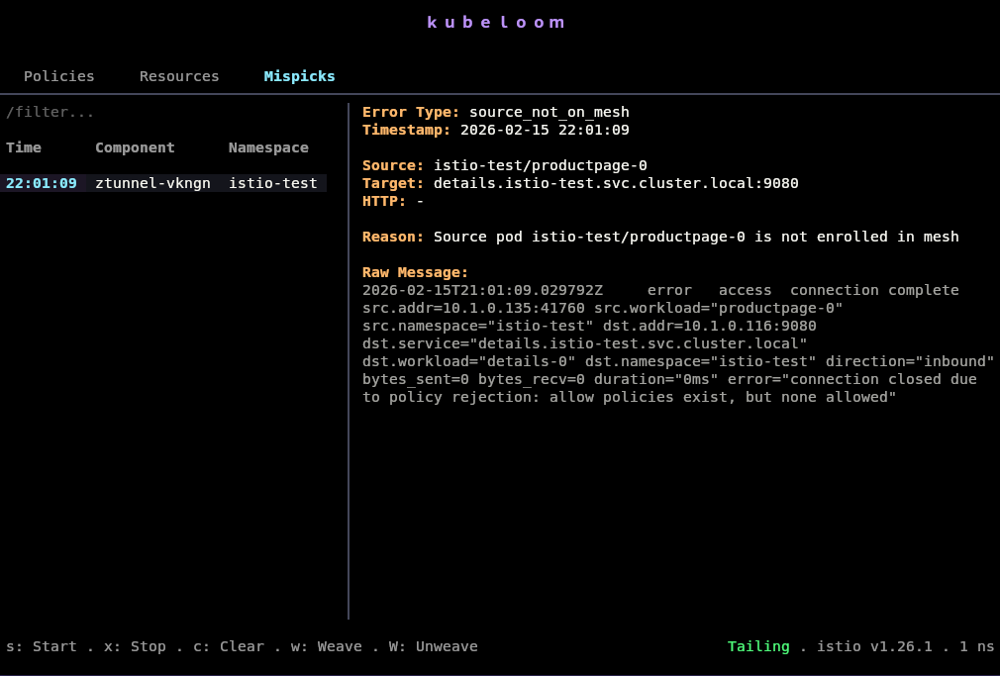
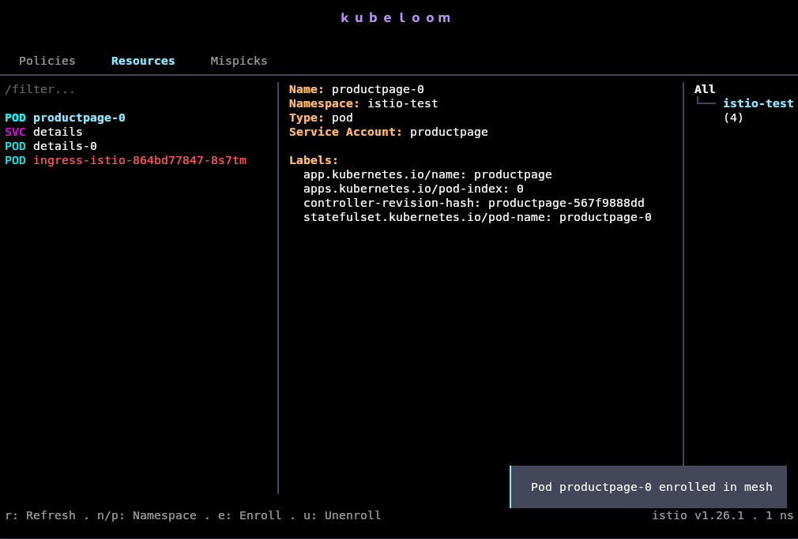
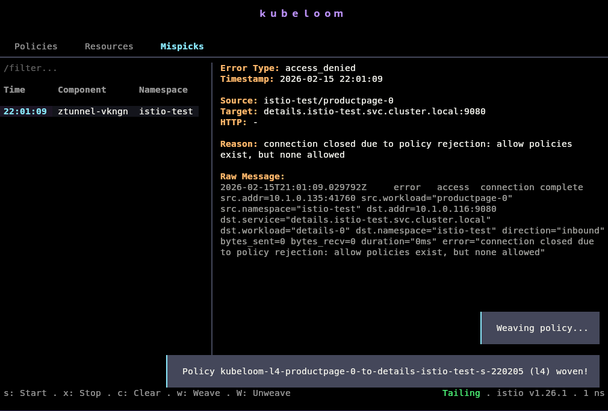
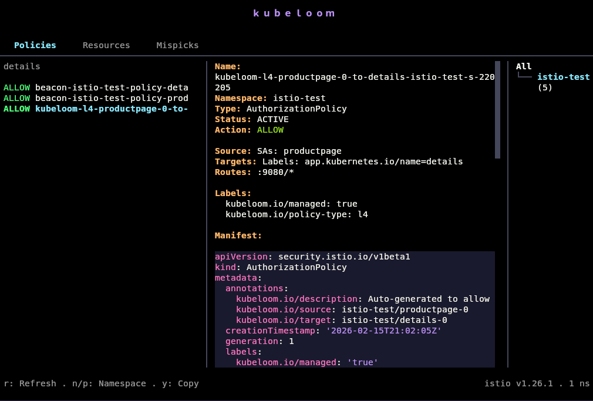
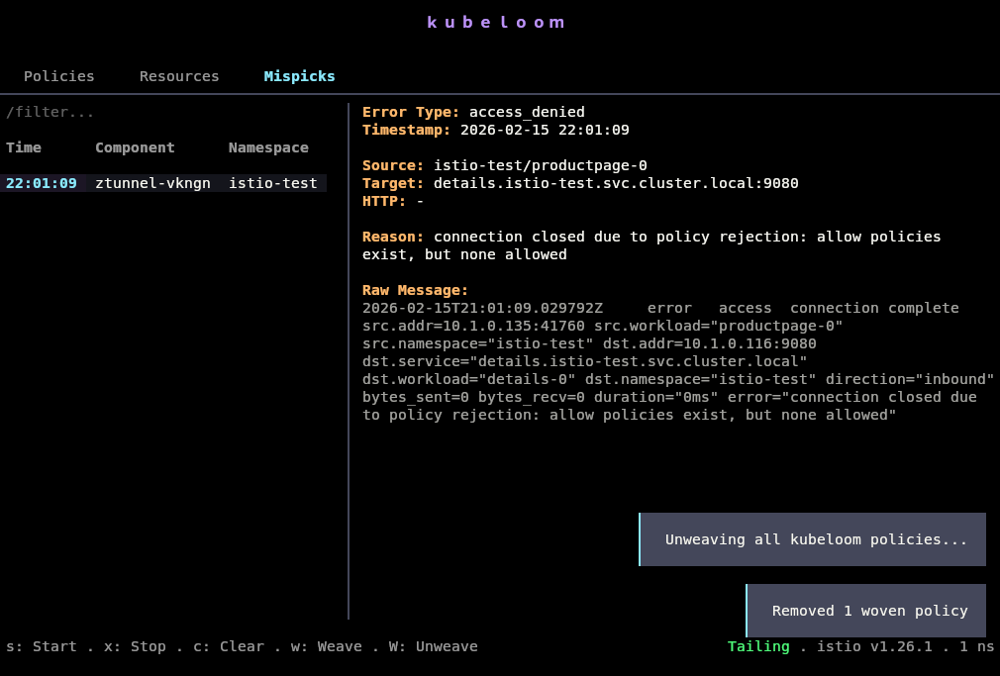
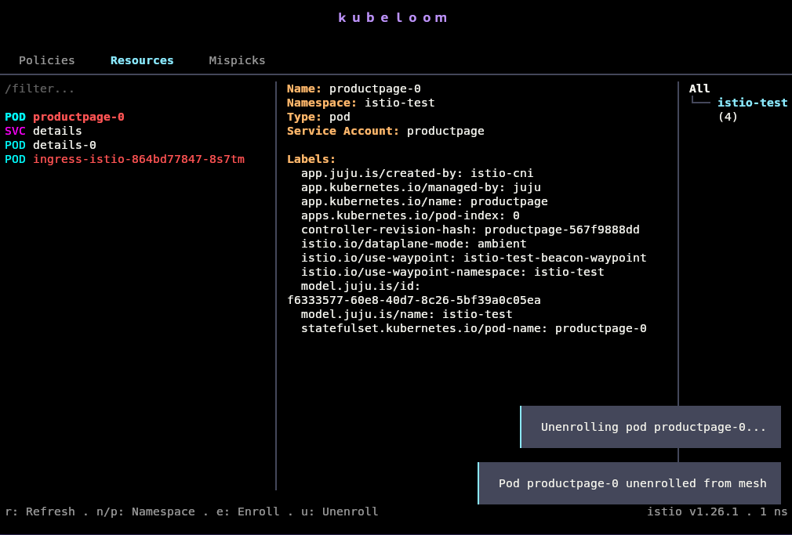

<h1 align="center">kubeloom</h1>

<p align="center">A service mesh debugging TUI built with Python and <a href="https://textual.textualize.io/">Textual</a></p>

## Installation

No need to install kubeloom. Run it directly with `uvx`:

```bash
uvx --python 3.12 --from git+https://github.com/adhityaravi/kubeloom kubeloom tui
```

> **Note:** Python 3.12 required. Python 3.14 has stricter SSL certificate validation that may cause issues with some Kubernetes clusters.

PyPI package coming soon for persistant installation.

## Why

Debugging service mesh issues with `kubectl logs` means grepping through thousands of log lines across multiple pods (ztunnel, waypoint, istiod), mentally correlating timestamps, and figuring out which denial came from where. kubeloom aggregates all of this into a single pane.

Instead of:
```bash
kubectl logs -n istio-system -l app=ztunnel --tail=1000 | grep -i denied
kubectl logs -n istio-system -l app=waypoint --tail=1000 | grep -i RBAC
# repeat for every namespace, every component, correlate manually...
```

You get a single TUI that tails everything, categorizes errors, and shows you exactly what's wrong.

## Mesh support

Currently supports **Istio ambient** mode only. Designed to be mesh agnostic with other mesh backends planned.

Built for debugging [Charmed Istio](https://github.com/canonical/istio-k8s-operator/) but should work with any Istio ambient deployment.

## Walkthrough

You've got a mesh. Something's broken. Let's debug.

### 1. Check your policies

Start in the **Policies** tab. You see all AuthorizationPolicies in your cluster, organized by namespace. The detail pane shows the full policy spec with sources, targets, and allowed routes. ALLOW policies are green, DENY policies are red.



### 2. Check affected resources

Switch to **Resources** tab (`2`). These are pods and services that are targeted by your policies. kubeloom pre filters these so you're not staring at every pod in the cluster.

Red highlighting means the pod isn't enrolled in the mesh and won't be able to communicate with mesh enrolled workloads.



### 3. Start tailing errors

Switch to **Mispicks** tab (`3`) and press `s` to start tailing logs. kubeloom watches all mesh firewall components (ztunnel, waypoint proxies) across all namespaces, parses their logs in real time, and categorizes errors:

| Error Type | Meaning |
|------------|---------|
| `source_not_on_mesh` | Source pod isn't enrolled so mesh can't identify it |
| `access_denied` | Policy explicitly blocked the request (RBAC denial) |
| `mtls_error` | mTLS handshake failed between workloads |
| `connection_error` | Upstream connection failed (502/503/504) |

The detail pane shows the full context: source workload, target service, port, HTTP method/path if L7, and the raw log line.

You see a `source_not_on_mesh` error. A pod is trying to talk to a mesh service, but the mesh can't identify who's calling because the source pod isn't enrolled.



### 4. Enroll the pod

Back to **Resources** tab (`2`). Find the pod that's not enrolled (highlighted red), select it with `j/k`, and press `e` to enroll it into the mesh.

kubeloom adds the appropriate labels/annotations to inject the sidecar or register with ztunnel depending on your mesh mode.



### 5. New error appears

Check **Mispicks** again (`3`). The `source_not_on_mesh` errors stop. But now you see `access_denied`. The pod is on the mesh now, the mesh knows who it is, but there's no AuthorizationPolicy allowing it to talk to the target service.


### 6. Weave a policy

With the `access_denied` error selected, press `w` to weave a policy. kubeloom generates an AuthorizationPolicy based on the error context. It extracts the source workload/namespace, target service/port, and creates an ALLOW policy.



> **Warning:** Woven policies are best effort. kubeloom extracts what it can from the error logs, but the generated policy might be too permissive, too restrictive, or just wrong. It's meant to unblock you during debugging, not to be your production policy.

### 7. Check the woven policy

Back to **Policies** tab (`1`). The new policy shows up, highlighted in cyan to indicate it's kubeloom managed. The labels tell you it's auto generated:

```yaml
labels:
  kubeloom.io/managed: "true"
  kubeloom.io/policy-type: l4
```



Traffic flows. You've identified the issue: this workload needed a policy to talk to that service.

### 8. Clean up

These are temporary debugging aids. To revert everything:

Press `W` (shift+w) in **Mispicks** to unweave all kubeloom created policies. This deletes every policy with the `kubeloom.io/managed: true` label.



Press `u` in **Resources** to unenroll the pod from the mesh.



Now you know what was wrong.

## Warning: Not for production

kubeloom's enroll and weave features are **debugging tools only**.

**Woven policies are best effort.** They're generated from log context which may be incomplete. The policy might allow more than intended or not cover all cases.

**No security review.** Auto generated policies haven't been reviewed by a human. Don't ship them to production.

**Temporary by design.** Use kubeloom to identify what's wrong, then write proper policies with appropriate scoping, review, and testing.

The enroll/unenroll and weave/unweave features exist to quickly unblock debugging, not to manage your production mesh.

## Keybindings

| Key | Action |
|-----|--------|
| `1/2/3` | Switch tabs (Policies / Resources / Mispicks) |
| `j/k` | Navigate up/down |
| `h/l` | Scroll detail pane |
| `n/p` | Next/prev namespace |
| `/` | Filter current list |
| `r` | Refresh data |
| `y` | Copy manifest to clipboard |
| `s` | Start tailing logs |
| `x` | Stop tailing logs |
| `c` | Clear collected errors |
| `e` | Enroll pod into mesh |
| `u` | Unenroll pod from mesh |
| `w` | Weave policy from error |
| `W` | Unweave all kubeloom policies |
| `q` | Quit |
